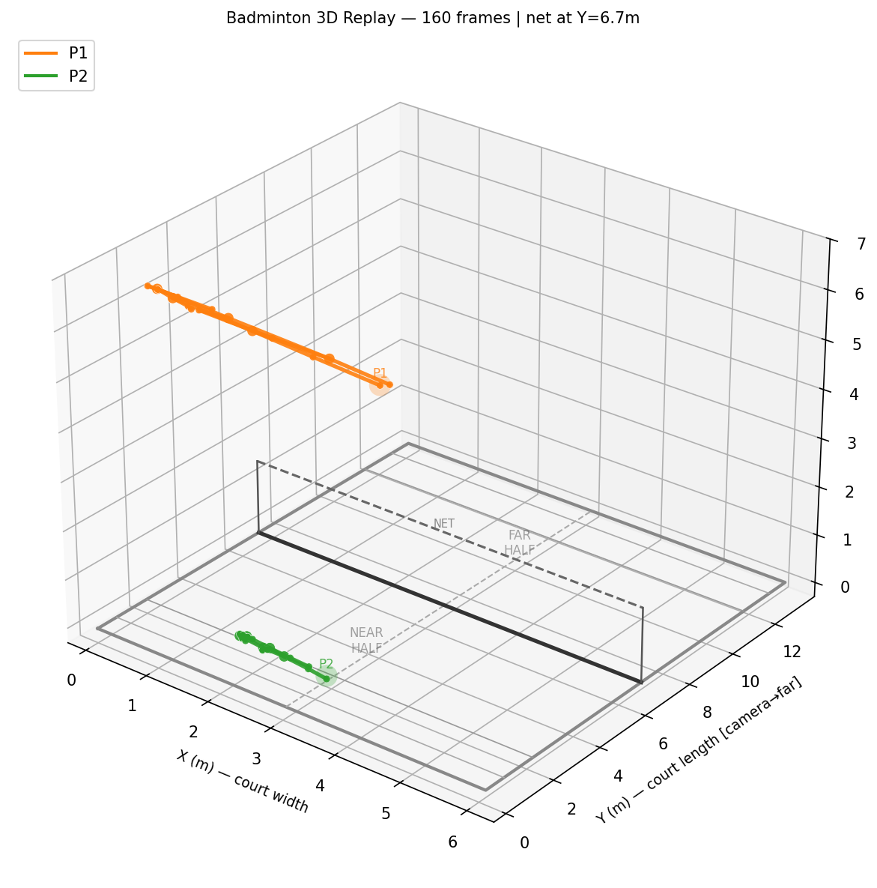
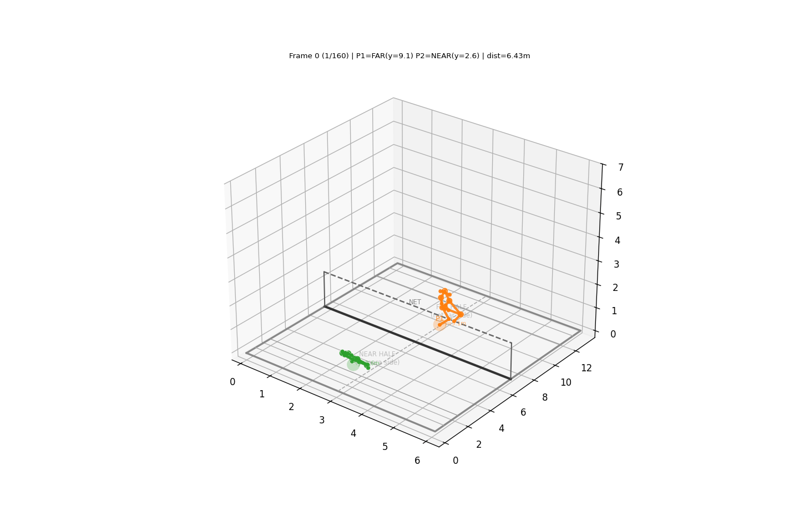

# Badminton Tracking & Analysis — 3D Reconstruction

A practical badminton video analysis pipeline focused on **stable 2-player tracking + shuttle tracking + 3D skeleton reconstruction** via 2D-to-3D lifting.

[](https://github.com/WilliamK112/badminton-machine-learning/actions/workflows/replay3d-ci.yml)

> GitHub Actions CI: see `.github/workflows/replay3d-ci.yml` for the Replay3D package+gate regression workflow.
>
> Replay3D package artifact download (for PR review):
> 1. Open the workflow run: <https://github.com/WilliamK112/badminton-machine-learning/actions/workflows/replay3d-ci.yml>
> 2. In the run page, open the **Summary** tab to see the Replay3D Job Summary block.
> 3. Scroll to **Artifacts** and download `replay3d-ci-package-<run_id>` (retained for 14 days).
> 4. Unzip and inspect package files.

## Demo (Latest)

<table>
  <tr>
    <td></td>
    <td></td>
  </tr>
  <tr>
    <td colspan="2" align="center">
      
    </td>
  </tr>
</table>

## 3D Skeleton Reconstruction Demos

> **Downloadable artifacts:** Replay3D package artifacts (包含完整 3D 预览视频) 可在 GitHub Actions workflow 页面下载，14天有效。
> 下载方式：Workflow → 运行记录 → Artifacts → `replay3d-ci-package-<run_id>`

**Top-down court view — skeleton limb rendering:**

| Frame 30 | Frame 130 |
|----------|-----------|
|  |  |

| Frame 175 | Frame 285 |
|----------|-----------|
|  |  |

| Frame 350 | Frame 945 |
|----------|-----------|
|  |  |

> Full video previews: `thisone_full_v4_preview.mp4`, `thisone_full_v5_preview.mp4`, `thisone_full_v6_preview.mp4` (in `reports/` — see artifact download above)

### 3D Court Box Model

> The 3D court bounding box reconstructed from a single camera view — player + shuttle trajectories projected into world (X, Y, Z) space.

**3D box summary (v11b — latest):**

| 3D Court Box Summary |
|----------|
|  |

**3D skeleton replay (v11b — latest):**

| 3D Skeleton Replay |
|----------|
|  |

## About

This project is built for demo-ready, reproducible badminton analysis outputs from match videos.
Current focus:
- Keep only on-court 2 players (avoid audience / sideline jumps)
- Keep shuttle trajectory continuous and visible
- **Lift 2D skeleton keypoints → 3D world coordinates** (single-view depth estimation)
- Preserve human pose (skeleton) data and visualization in the final output

## Tech Stack / Models Used

### Core Libraries
- Python 3
- OpenCV
- Ultralytics YOLO (YOLO11)
- NumPy / SciPy

### Detection & Tracking Models
- **Player detection/tracking:** `yolo11n.pt` (person class + temporal constraints)
- **Pose estimation:** `yolo11n-pose.pt`
- **Shuttle primary model:** `best.pt` (custom trained shuttle detector)
- **Shuttle fallback model:** `yolo11n.pt` (sports-ball class fallback)

### 3D Reconstruction
- **2D→3D Lifting:** Custom single-view depth estimation via homography + Z-axis anchoring
- **Camera Model:** Homography-based court calibration (focal=773, principal point=960,950)
- **Z-Axis Anchor:** Lowest keypoint (foot) clamped to 0.12m, other joints scaled anatomically

## Project Structure

```text
badminton-machine-learning/
├── README.md
├── scripts/
│   ├── replay3d_keypoint3d_lift.py   # 2D→3D skeleton lifting
│   ├── replay3d_render_v5.py          # 3D replay visualization
│   └── validate_3d_reconstruction.py # validation + comparison
├── demo/
│   └── gif/
│       ├── 截屏2026-03-25 01.40.31.png
│       ├── frame_0010.jpg
│       └── badminton_github_long.gif
├── runs/                              # generated outputs (local only)
└── .github/workflows/
    └── replay3d-ci.yml                # CI regression workflow
```

## Current Output Style

Output includes:
- 3D skeleton keypoints + limbs (reprojected to 2D image)
- Player 1 / Player 2 labels
- Shuttle marker + trajectory
- Top-down court view + 3D perspective side-by-side render

## Quick Start

### 2D→3D Skeleton Lifting

```bash
cd badminton-machine-learning
python scripts/replay3d_keypoint3d_lift.py \
  --input runs/replay3d_keypoint_lift_011/lifted_keypoints.jsonl \
  --output runs/replay3d_render_v11
```

### 3D Replay Render

```bash
python scripts/replay3d_render_v5.py \
  --lifted runs/replay3d_keypoint_lift_011/lifted_keypoints.jsonl \
  --output runs/replay3d_render_v11b \
  --z-sep
```

### Validation

```bash
python scripts/validate_3d_reconstruction.py \
  --lifted runs/replay3d_keypoint_lift_011/lifted_keypoints.jsonl \
  --original runs/replay3d_keypoint_lift_011/keypoints.jsonl
```

## Replay3D Quick Commands

```bash
# Build validated Replay3D package (JSONL + preview + quality + meta + manifest)
make replay3d-package

# Run package gate smoke (healthy package must pass, corrupted package must fail)
make replay3d-gate

# CI-style one-command regression (package + gate smoke)
make replay3d-ci

# Inspect latest CI package locally
make replay3d-inspect

# Full local release gate
make replay3d-full-gate

# Compact reviewer snippet extracted from full-gate summary
make replay3d-full-gate-snippet
```

## Notes

- This repo keeps the latest demo-facing pipeline and visuals clean.
- Large temporary artifacts (outputs/reports/trash) are local and excluded from git.
- 3D reconstruction is validated against known court geometry (13.4m × 6.1m).
